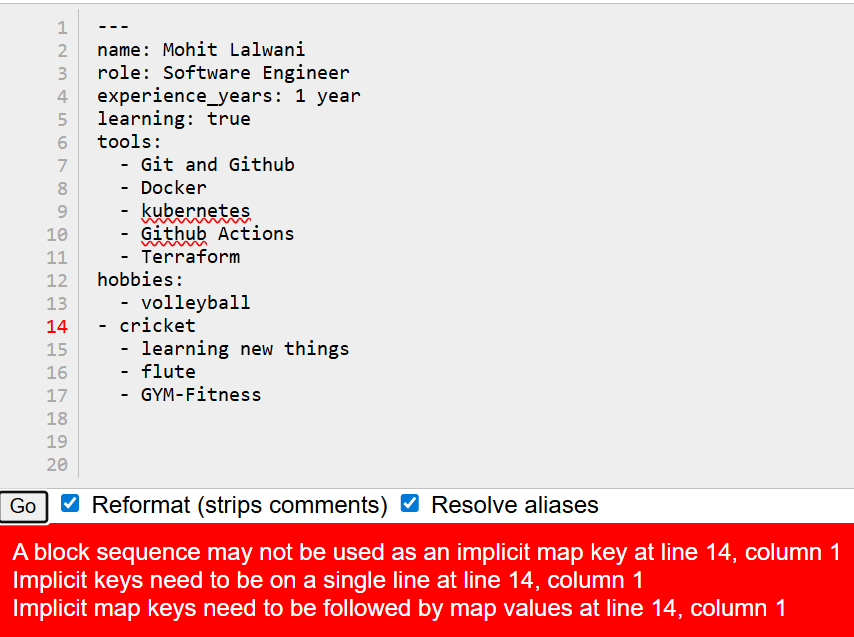
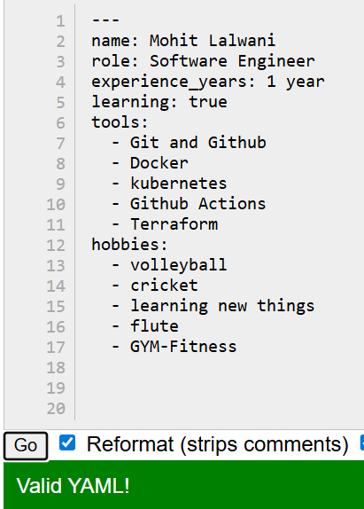

# Day 38 – YAML Basics

## Task
Before writing a single CI/CD pipeline, you need to get comfortable with **YAML** — the language every pipeline is written in.

You will:
- Understand YAML syntax and rules
- Write YAML files by hand
- Validate them

---

## Expected Output
- A markdown file: `day-38-yaml.md`
- YAML files you create during the tasks

---

## Challenge Tasks

### Task 1: Key-Value Pairs
Create `person.yaml` that describes yourself with:
- `name`
- `role`
- `experience_years`
- `learning` (a boolean)

**Verify:** Run `cat person.yaml` — does it look clean? No tabs?
- validation error

    [person.yml](files/person.yml)

---

### Task 2: Lists
Add to `person.yaml`:
- `tools` — a list of 5 DevOps tools you know or are learning
- `hobbies` — a list using the inline format `[item1, item2]`

Write in your notes: What are the two ways to write a list in YAML?

1-
```sh
tools:
  - Git and Github
  - Docker
  - kubernetes
  - Github Actions
  - Terraform
```
2-
```sh
hobbies: [volleyball , cricket , learning new things , flute , GYM-Fitness]
```
--- 

### Task 3: Nested Objects
Create `server.yaml` that describes a server:
- `server` with nested keys: `name`, `ip`, `port`
- `database` with nested keys: `host`, `name`, `credentials` (nested further: `user`, `password`)

**Verify:** Try adding a tab instead of spaces — what happens when you validate it?
- validation error

    [server.yml](files/server.yml)

---

### Task 4: Multi-line Strings
In `server.yaml`, add a `startup_script` field using:
1. The `|` block style (preserves newlines)
2. The `>` fold style (folds into one line)

Write in your notes: When would you use `|` vs `>`?

1-
```sh
# | : Literal block style: Preserves newlines (good for scripts)
startup_script: |
  #!/bin/bash
  apt-get update
  apt-get install -y nginx 
  echo "starting nginx"
  systemctl start nginx
  systemctl status nginx
```

2-
```sh
# > : Folded block style: Folds lines into one single string
description: >
  echo "This is the script to run the nginx 
  and check the status of it."
```

---

### Task 5: Validate Your YAML
1. Install `yamllint` or use an online validator
2. Validate both your YAML files
3. Intentionally break the indentation — what error do you get?
4. Fix it and validate again

* Invalid
    

* Valid
    

---

### Task 6: Spot the Difference
Read both blocks and write what's wrong with the second one:

```yaml
# Block 1 - correct
name: devops
tools:
  - docker
  - kubernetes # --> indentaion is correct
```

```yaml
# Block 2 - broken
name: devops
tools:
- docker
  - kubernetes # --> indentaion is incorrect
```
* Indentation is wrong in second block

---

## What you learned (3 key points)
* Learned basics of yml 
* Basic nuances of yml file like - multiline commands and commit with the help of | : Literal block style , and > : Folded block style: