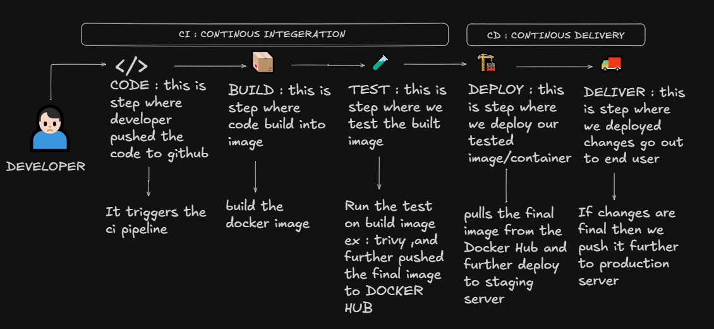

# Day 39 – What is CI/CD?

## Challenge Tasks

### Task 1: The Problem
Think about a team of 5 developers all pushing code to the same repo manually deploying to production.

Write in your notes:

1. What can go wrong?
    - Consistency : One developer's changes can overwrite anoother's if they push at the same time
    - No rollback strategy: Reverting to a previous state is often manual, slow, and risky.
    - Human error/Configuration Drift: A deveoper might forget to change config file, use the wrong branch, skip a compilation etc.
    - Production Downtime: Manual pushes often requires server restartsor cause service interruptions.
    - No Audit Trail: If the site breaks at 3:00 AM, it is nearly impossible to tell which of the 5 developers' manual changes caused the crash.

2. What does "it works on my machine" mean and why is it a real problem?
    - Definition: A developer's code works fine on his machine but fails in production or any other machine.
    - It happes because of difference in dependencies, OS versions, libraries, database schemas.
    - It leads to wasted debugging time, finger-pointing, and unstable deployments

3. How many times a day can a team safely deploy manually?
    - 1–2 times per day at most.
        * Why limited:
            - Each manual deployment requires checks, downtime windows and human oversight.
            - More frequent deployment increases the chance of mistkes and production instability.

---

### Task 2: CI vs CD
Research and write short definitions (2-3 lines each):
1. **Continuous Integration** — what happens, how often, what it catches

    - What happens : CI means continous integeration in the production code base which code -> test -> build ,  are the main components of the CI.
    - How often : Any small changes in the code leads up to CI.
    - what it catches : 
        - Compiling errors, logic errors, integration issues, environment drift. 
    - Example: Facebook
       - Engineers commit code dozens of times per day. Every commit triggers automated  builds and tests across thousands of servers.

2. **Continuous Delivery** — how it's different from CI, what "delivery" means

    - How it's different from CI : CD means continous delivery to the user-end , its is the final step to deliver all the changes that we made and automated it via CI.
    - What "delivery" means - Delivery means delivery to user-end (final consumer) , who is able to view all the updates.
    - Example: Amazon
       - Every service is packaged and tested. Artifacts are stored in registries. And deployment can be triggred at any time.

3. **Continuous Deployment** — how it differs from Delivery, when teams use it
    - How it differs from Delivery : Continuous Deployment - this means continous deployment to the server not to the end user. 
    - When teams use it : This is the intermediatory step between CI AND CD , right after CI teams uses it for deployment.
    - Example: Netflix
        - Code that passes automated tests is automatically deployed to production without human approval. It relies on strong monitoring, canary releases and rollback systems.

---

### Task 3: Pipeline Anatomy
A pipeline has these parts — write what each one does:
- **Trigger** — what starts the pipeline
    -  What starts the pipeline. It can a push, pull request, sceduled cron job, manual action.
    - Automatic trigger on push
    on: 
        push:
            branches: [main]
    
    - Manual click need to triger the pipeline
    on:
        workflow_dispatch:

- **Stage** — a logical phase (build, test, deploy)
    - CODE : This is the stage where we check our code
    - BUILD : Here we build the docker image of the code 
    - TEST : Here we test our docker image
    - DEPLOY : This is the final stage of the pipeline which make makes the changes available to end user

- **Job** — a unit of work inside a stage
    - job means a particular task we have specific jobs for very specific stage : CODE -> BUILD -> TEST -> DEPLOY

- **Step** — a single command or action inside a job
    - It is the subpart of the job ,every job have certain number of step to execute, which have step like checkout code and execute these commands 

- **Runner** — the machine that executes the job
    - Runner is the server where we run all the workflows , runner have its own os like a server , ex: ubuntu-latest

- **Artifact** — output produced by a job
    - An output produced by a job, stored for later use.
    - Examples: Docker image, compiled binaries.
    - Allows sharing results between stages(build->test->deploy)

---

### Task 4: Draw a Pipeline
Draw a CI/CD pipeline for this scenario:
> A developer pushes code to GitHub. The app is tested, built into a Docker image, and deployed to a staging server.

    

Include at least 3 stages. Hand-drawn and photographed is perfectly fine.

---

### Task 5: Explore in the Wild
1. Open any popular open-source repo on GitHub (Kubernetes, React, FastAPI — pick one you know)
2. Find their `.github/workflows/` folder
3. Open one workflow YAML file

    [devsecops-pipeline.yml](https://github.com/Mohit-lalwani-flow/github-actions-zero-to-hero/blob/main/.github/workflows/devsecops-pipeline.yml)

4. Write in your notes:
   - What triggers it?
        - automatic push 
        - directly on main branch 

   - How many jobs does it have?
        - There are 8 jobs includes both CI and CD with DevSecOps practices
        - [code-quality , secrets-scan , dependency-scan , docker-scan , tests , build , trivy , deploy]

   - What does it do? (best guess)
        - Best thing of this workflow is it follows all the mordern practice of DevSecOps . 

---
