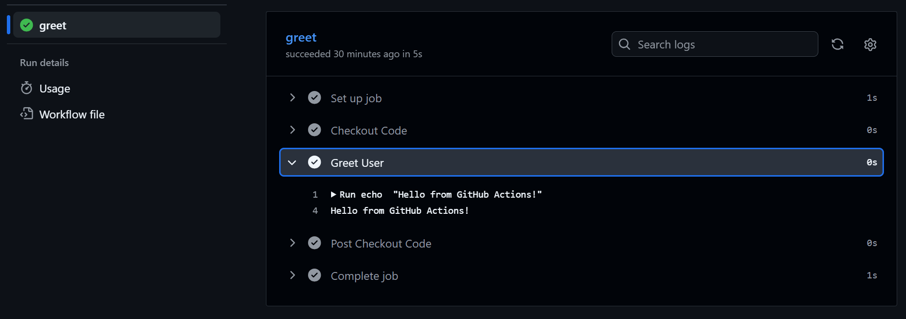
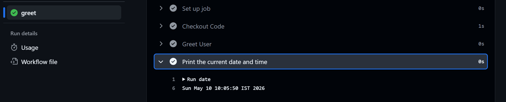
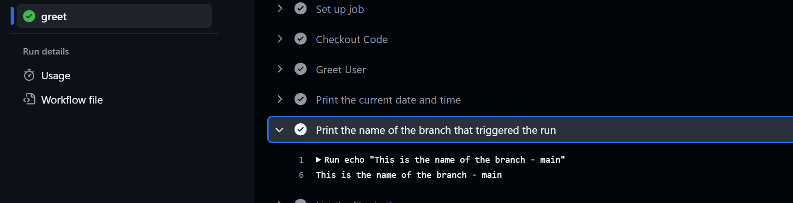
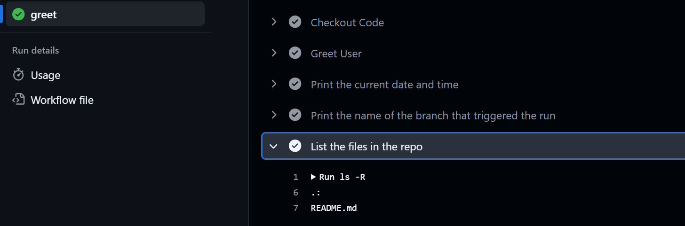
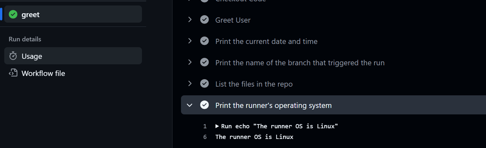
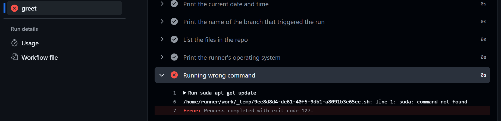
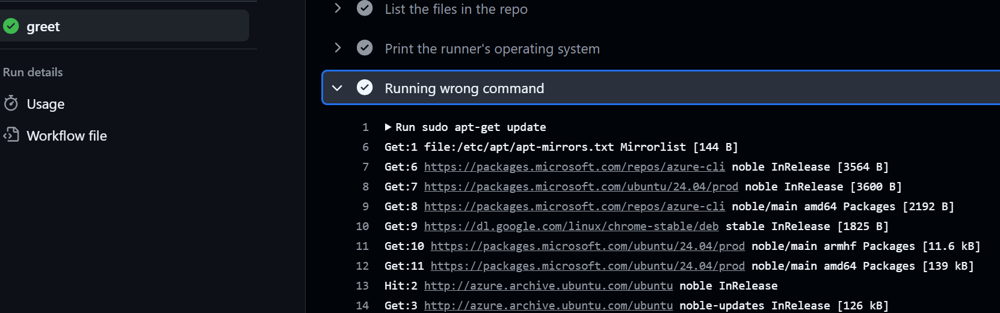

# Day 40 – Your First GitHub Actions Workflow

## Task
Today you write your **first GitHub Actions pipeline** and watch it run in the cloud.

This is the moment CI/CD stops being a concept and becomes real.

---

## Challenge Tasks

### Task 1: Set Up
1. Create a new **public** GitHub repository called `github-actions-practice`
2. Clone it locally
3. Create the folder structure: `.github/workflows/`

    [github-actions-practince](https://github.com/Mohit-lalwani-flow/github-actions-practice)

---

### Task 2: Hello Workflow
Create `.github/workflows/hello.yml` with a workflow that:
1. Triggers on every `push`
2. Has one job called `greet`
3. Runs on `ubuntu-latest`
4. Has two steps:
   - Step 1: Check out the code using `actions/checkout`
   - Step 2: Print `Hello from GitHub Actions!`

Push it. Go to the **Actions** tab on GitHub and watch it run.

**Verify:** Is it green? Click into the job and read every step.



---

### Task 3: Understand the Anatomy
Look at your workflow file and write in your notes what each key does:
- `on:` 
    Defines the events(push,pull_request) that trigger the workflow to run.


- `jobs:`
    job is a task that workflow does , further breaks into small step

- `runs-on:`
    This is the way to specify runner(server/VM) of the workflow , this runner is provided by GITHUB only.

- `steps:`
    It is the smallest unit of the workflow which is subpart of jobs

- `uses:`
    This is the standard way of invoking github actions command ,, Refers to pre-built GitHub Actions or reusable workflows.

- `run:`
    This is way to execute a step (executes script or command)

- `name:` (on a step)
    This specifies name of the step (what that step does)

---

### Task 4: Add More Steps
Update `hello.yml` to also:
1. Print the current date and time



2. Print the name of the branch that triggered the run (hint: GitHub provides this as a variable)



3. List the files in the repo



4. Print the runner's operating system



Push again — watch the new run.

---

### Task 5: Break It On Purpose
1. Add a step that runs a command that will **fail** (e.g., `exit 1` or a misspelled command)

```sh
- name: Running wrong command 
  #run: suda apt-get update # --> instead of sudo i wrote suda
```

2. Push and observe what happens in the Actions tab



3. Fix it and push again

```sh
run: sudo apt-get update # --> fixed command 
```



Write in your notes: What does a failed pipeline look like? How do you read the error?

    It was clearly mentioned suda command not found , as you can see in first image of task 1

---


