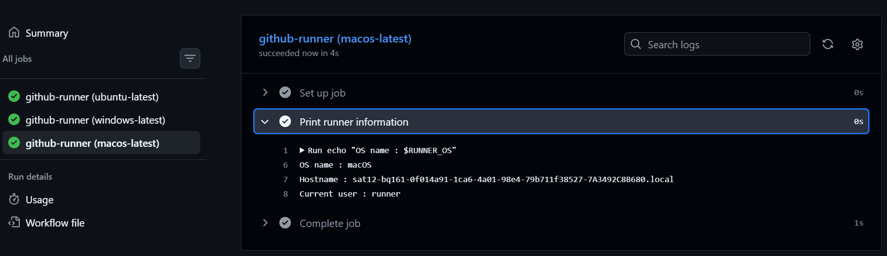
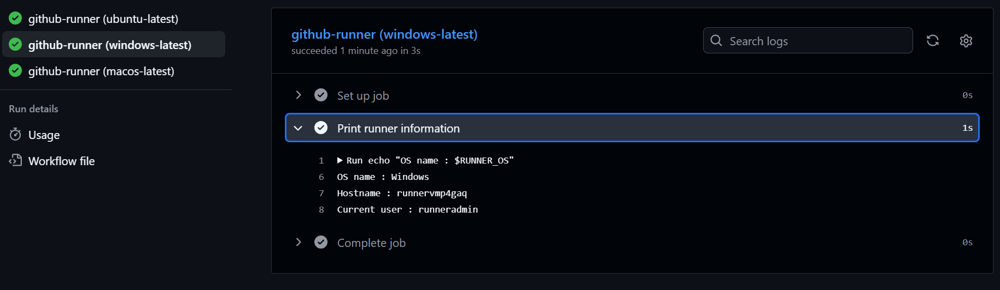
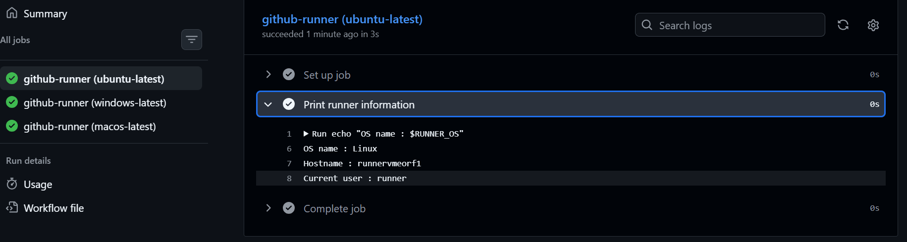
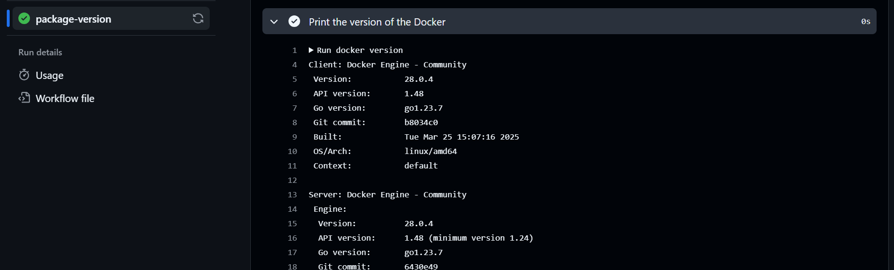
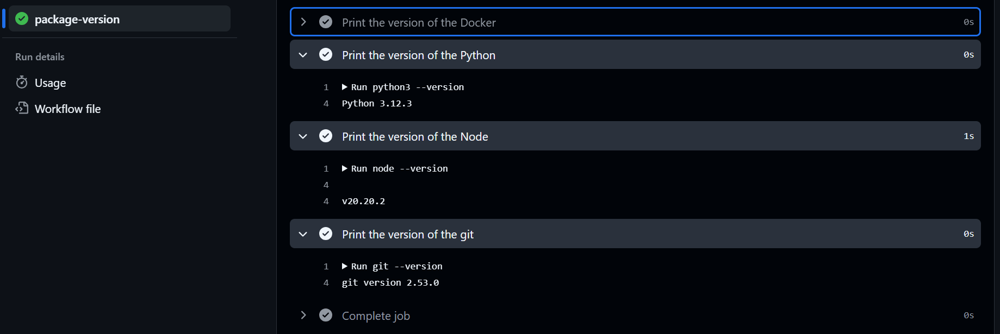
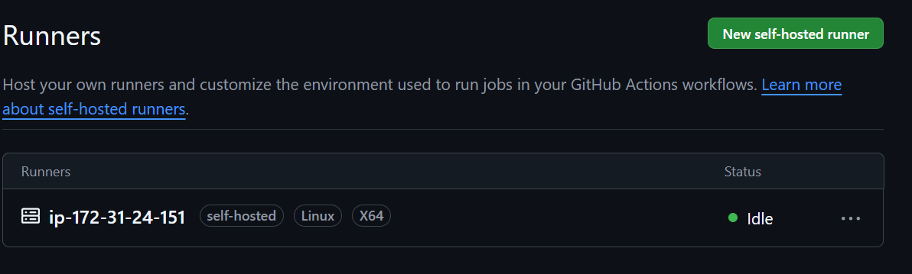
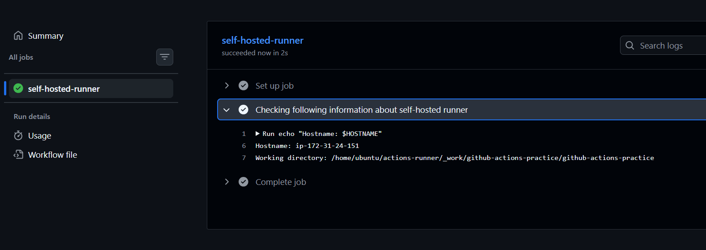
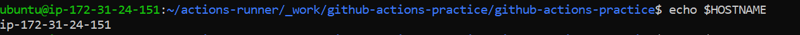

# Day 42 – Runners: GitHub-Hosted & Self-Hosted

## Task
Every job needs a machine to run on. Today you understand **runners** — GitHub's hosted ones and how to set up your own self-hosted runner on a real server.

---

## Challenge Tasks

### Task 1: GitHub-Hosted Runners
1. Create a workflow with 3 jobs, each on a different OS:
   - `ubuntu-latest`
   - `windows-latest`
   - `macos-latest`
2. In each job, print:
   - The OS name
   - The runner's hostname
   - The current user running the job
3. Watch all 3 run in parallel

[github-actions-runner.yml](https://github.com/Mohit-lalwani-flow/github-actions-practice/blob/main/.github/workflows/github-actions-runner.yml)

- For MacOS


- For Windows


- For Ubuntu


Write in your notes: What is a GitHub-hosted runner? Who manages it?

(Runner) Server which runs these workflows and these are managed by github only on there cloud azure

---

### Task 2: Explore What's Pre-installed
1. On the `ubuntu-latest` runner, run a step that prints:
   - Docker version
   - Python version
   - Node version
   - Git version
2. Look up the GitHub docs for the full list of pre-installed software on `ubuntu-latest`

[package-version-runner.yml](https://github.com/Mohit-lalwani-flow/github-actions-practice/blob/main/.github/workflows/package-version-runner.yml)





Write in your notes: Why does it matter that runners come with tools pre-installed?

- Speed
    Faster Builds: Eliminates tool download time.
    Quick Starts: Steps execute almost instantly.
    Less Traffic: Saves network bandwidth usage.
- Consistency
    Identical Environments: Every job runs identically.
    Fewer Flakes: Reduces external download failures.
    Predictable Versions: Lock into specific software baselines.
- Simplicity
    Clean YAML: Fewer lines of setup code.
    No Boilerplate: Skip repetitive apt-get or brew commands.
    Easy Onboarding: New workflows work out of the box.
- Cost Efficiency 
    Lower Minutes: Shorter run times save money.
    Free Storage: Heavy tools use runner disk space

---

### Task 3: Set Up a Self-Hosted Runner
1. Go to your GitHub repo → Settings → Actions → Runners → **New self-hosted runner**
2. Choose Linux as the OS
3. Follow the instructions to download and configure the runner on:
   - Your local machine, OR
   - A cloud VM (EC2, Utho, or any VPS)
4. Start the runner — verify it shows as **Idle** in GitHub

**Verify:** Your runner appears in the Runners list with a green dot.



---

### Task 4: Use Your Self-Hosted Runner
1. Create `.github/workflows/self-hosted.yml`
2. Set `runs-on: self-hosted`
3. Add steps that:
   - Print the hostname of the machine (it should be YOUR machine/VM)
   - Print the working directory
   - Create a file and verify it exists on your machine after the run
4. Trigger it and watch it run on your own hardware

**Verify:** Check your machine — is the file there?

[self-hosted.yml](https://github.com/Mohit-lalwani-flow/github-actions-practice/blob/main/.github/workflows/self-hosted.yml)






---

### Task 5: Labels
1. Add a **label** to your self-hosted runner (e.g., `my-linux-runner`)

2. Update your workflow to use `runs-on: [self-hosted, my-linux-runner]`
```sh
 # Changed to target your specific label
 runs-on: [self-hosted, my-linux-runner]
```
3. Trigger it — does it still pick up the job?

- Yes , it still works , just we need to add that label (in this case - my-linux-runner) in github repo -> setting -> runner -> create and add the label

Write in your notes: Why are labels useful when you have multiple self-hosted runners?

- Labels are useful to identify runner when there are multiple self-hosted runners

---

### Task 6: GitHub-Hosted vs Self-Hosted
Fill this in your notes:

| | GitHub-Hosted | Self-Hosted |
|---|---|---|
| Who manages it? | Gtihub manages it  | We manage it |
| Cost | Free 2000 min (per month , public repos unlimited) | We need pay for the server as per the our own usage |
| Pre-installed tools | Yes all the common tools and packages are pre-installed | We need to install as per our needed |
| Good for | If you don`t want to manage and wants things simple | If you want full control |
| Security concern | Controlled by Github - But still use reliable package make sure they are trusted and available on github market place | We need make sure everything from os to any dependency |

---


