# Day 44 – Secrets, Artifacts & Running Real Tests in CI

## Challenge Tasks

### Task 1: GitHub Secrets
1. Go to your repo → Settings → Secrets and Variables → Actions
2. Create a secret called `MY_SECRET_MESSAGE`
3. Create a workflow that reads it and prints: `The secret is set: true` (never print the actual value)
4. Try to print `${{ secrets.MY_SECRET_MESSAGE }}` directly — what does GitHub show?

Write in your notes: Why should you never print secrets in CI logs?
    * If we print out our secrets (AWS secrets key or API key ) publically security concern will arise.

[secrets.yml](https://github.com/Mohit-lalwani-flow/github-actions-practice/blob/main/.github/workflows/secrets.yml)

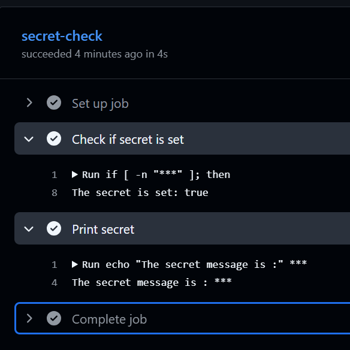

---

### Task 2: Use Secrets as Environment Variables
1. Pass a secret to a step as an environment variable
2. Use it in a shell command without ever hardcoding it
3. Add `DOCKER_USERNAME` and `DOCKER_TOKEN` as secrets (you'll need these on Day 45)

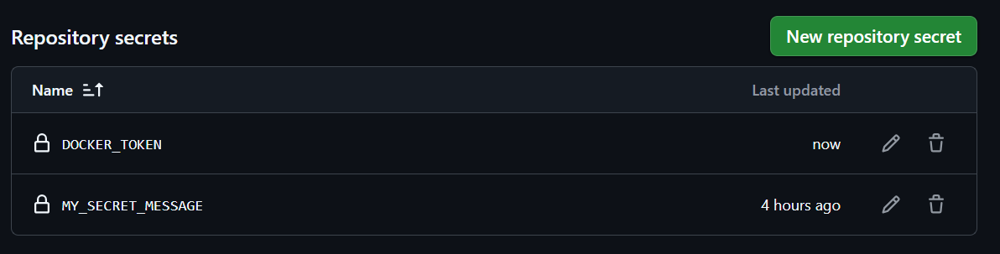
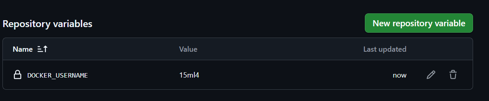

---

### Task 3: Upload Artifacts
1. Create a step that generates a file — e.g., a test report or a log file
2. Use `actions/upload-artifact` to save it
3. After the workflow runs, download the artifact from the Actions tab

**Verify:** Can you see and download it from GitHub?

[artifacts.yml](https://github.com/Mohit-lalwani-flow/github-actions-practice/blob/main/.github/workflows/artifacts.yml)

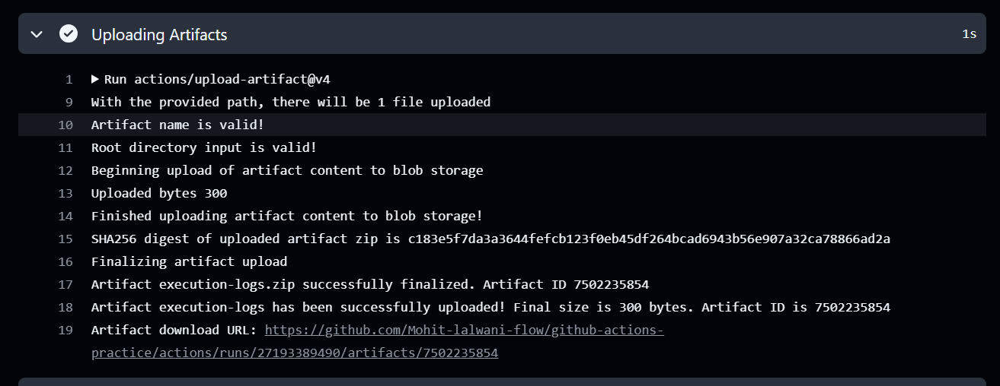
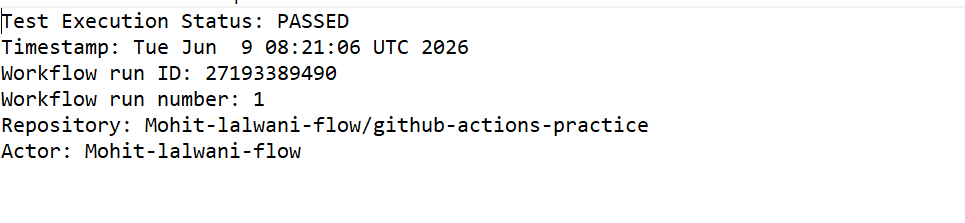

---

### Task 4: Download Artifacts Between Jobs
1. Job 1: generate a file and upload it as an artifact
2. Job 2: download the artifact from Job 1 and use it (print its contents)

Write in your notes: When would you use artifacts in a real pipeline?
    * They’re used when you need to persist and share files across jobs that don’t run in the same execution environment.

[copy-artifacts.yml](https://github.com/Mohit-lalwani-flow/github-actions-practice/blob/main/.github/workflows/copy-artifacts.yml)

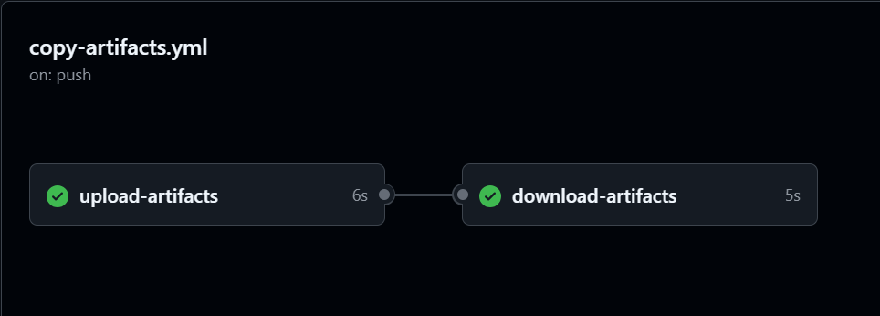
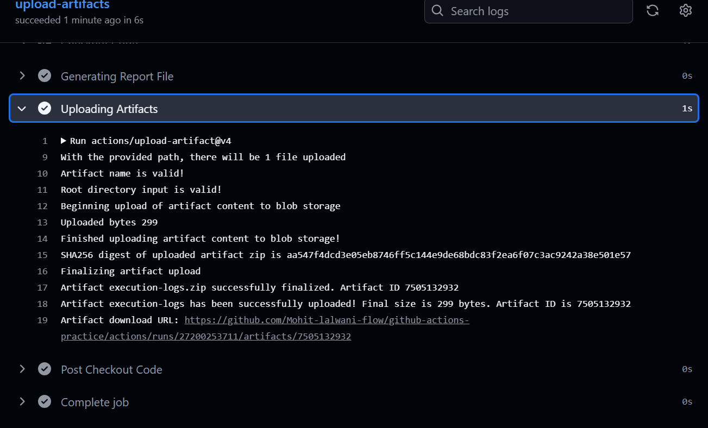
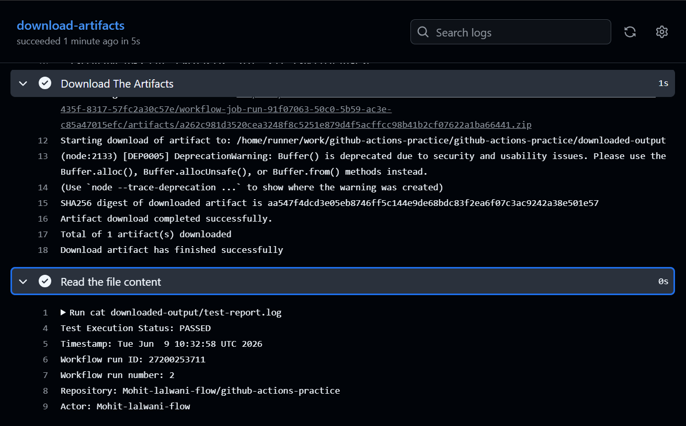

---

### Task 5: Run Real Tests in CI
Take any script from your earlier days (Python or Shell) and run it in CI:
1. Add your script to the `github-actions-practice` repo
2. Write a workflow that:
   - Checks out the code
   - Installs any dependencies needed
   - Runs the script
   - Fails the pipeline if the script exits with a non-zero code
3. Intentionally break the script — verify the pipeline goes red
4. Fix it — verify it goes green again

[run-script.yml](https://github.com/Mohit-lalwani-flow/github-actions-practice/blob/main/.github/workflows/run-script.yml)

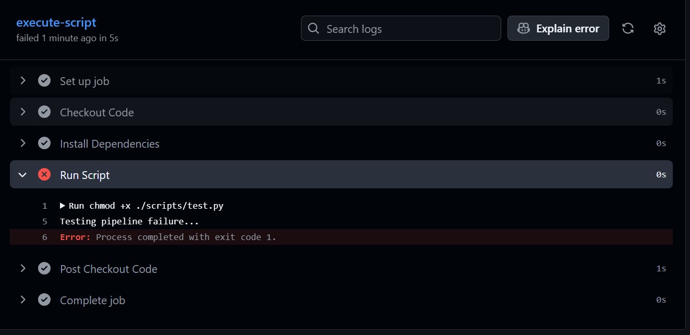
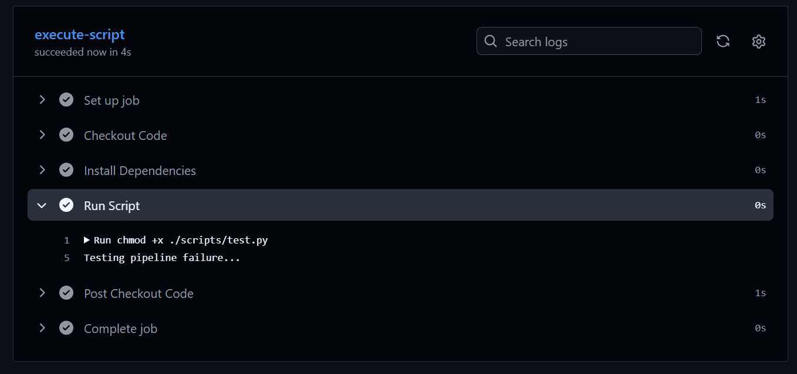
---

### Task 6: Caching
1. Add `actions/cache` to a workflow that installs dependencies
2. Run it twice — observe the time difference
3. Write in your notes: What is being cached and where is it stored?
    * Dependencies, artifacts, packages, build artifacts can be cached. 
    * It is stored in github's centralized cache storage.
    * It is repo based, each repo has 10GB quota for storing cache.
    * Cache is stored for 7 days default unless you use `retention-days` to set days.
      (maximum is 90days)

[cached-run.yml](https://github.com/Mohit-lalwani-flow/github-actions-practice/blob/main/.github/workflows/cached-run.yml)

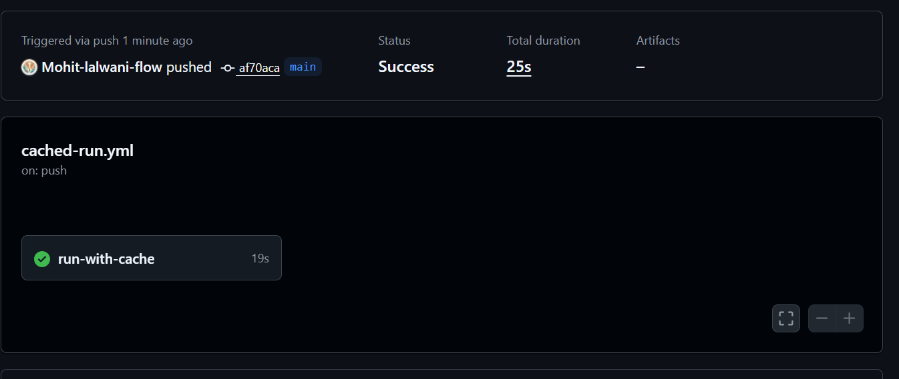
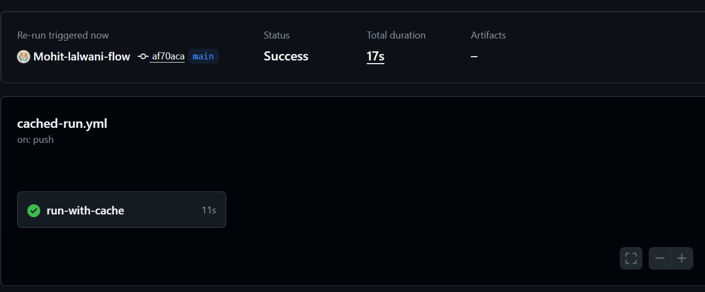

---

